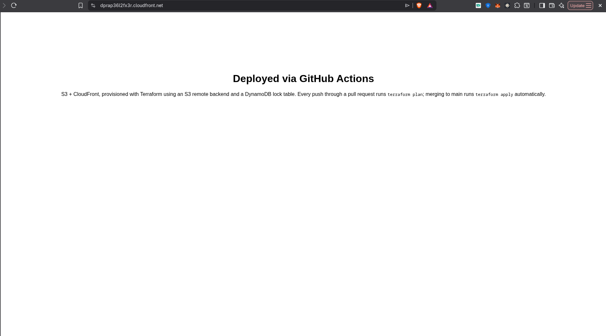

# S3 + CloudFront Static Site — Remote State & GitHub Actions CI/CD

A static site served via S3 + CloudFront, with Terraform state stored
remotely (S3 backend + DynamoDB locking) and infra changes deployed
automatically through GitHub Actions: `plan` on every pull request,
`apply` on merge to `main`.

## Why this project

Builds on a plain S3+CloudFront static-site pipeline by adding the two
things that make Terraform usable on a real team: **remote state with
locking**, and a **CI/CD pipeline that plans and applies changes for you**
instead of running `terraform apply` from a laptop.

## Structure

```
bootstrap/    # run once, manually — creates the state bucket + lock table
site/         # the actual site infra — uses the bootstrap resources as backend
.github/
  workflows/
    terraform.yml   # plan on PR, apply on merge to main
```

## Setup

### 1. Bootstrap the remote state backend (one-time, manual)

```bash
cd bootstrap
terraform init
terraform apply -var="state_bucket_name=YOUR-UNIQUE-BUCKET-NAME"
```

Note the `state_bucket_name` and `lock_table_name` outputs.

### 2. Point the site module at that backend

Edit `site/backend.tf` and replace the bucket/table placeholders with the
values from step 1.

```bash
cd ../site
terraform init
terraform apply -var="site_bucket_name=YOUR-OTHER-UNIQUE-BUCKET-NAME"
```

Confirm it works locally before wiring up CI.

### 3. Wire up GitHub Actions

In your repo settings, add these secrets:
- `AWS_ACCESS_KEY_ID`
- `AWS_SECRET_ACCESS_KEY`

(Scope this IAM user tightly — S3, CloudFront, and the state bucket/table
only. Don't reuse root credentials.)

From here:
- Any PR touching `site/**` gets a `terraform plan` posted as a PR comment
- Merging to `main` runs `terraform apply` automatically

## Architecture

```
GitHub PR  →  Actions: terraform plan  →  plan posted as PR comment
     ↓ (merge to main)
GitHub Actions: terraform apply  →  S3 (site content) → CloudFront (CDN)
                                          ↑
                          Terraform state: S3 (versioned) + DynamoDB (lock)
```

The S3 site bucket is fully private — CloudFront reaches it through Origin
Access Control, nothing is exposed directly.

## Stack

Terraform (S3 backend + DynamoDB locking) · AWS (S3, CloudFront, IAM) ·
GitHub Actions

## Notes

- `site/content/index.html` is a placeholder — swap in real site content.
- ACM/custom domain isn't wired up here (uses the CloudFront default
  certificate); adding a custom domain + ACM cert is a natural next step.

## Proof of deployment

